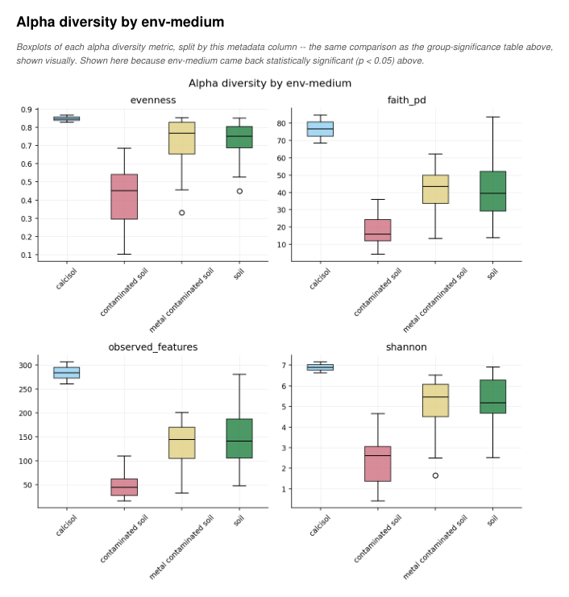
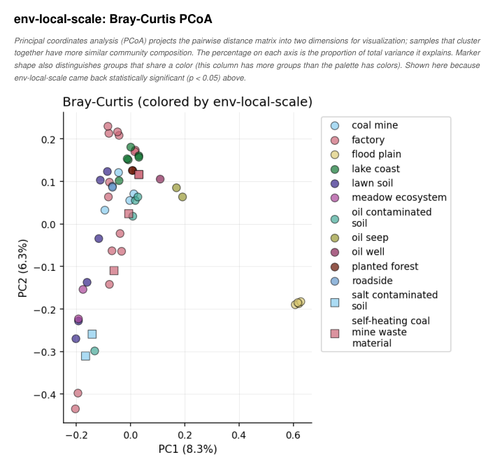
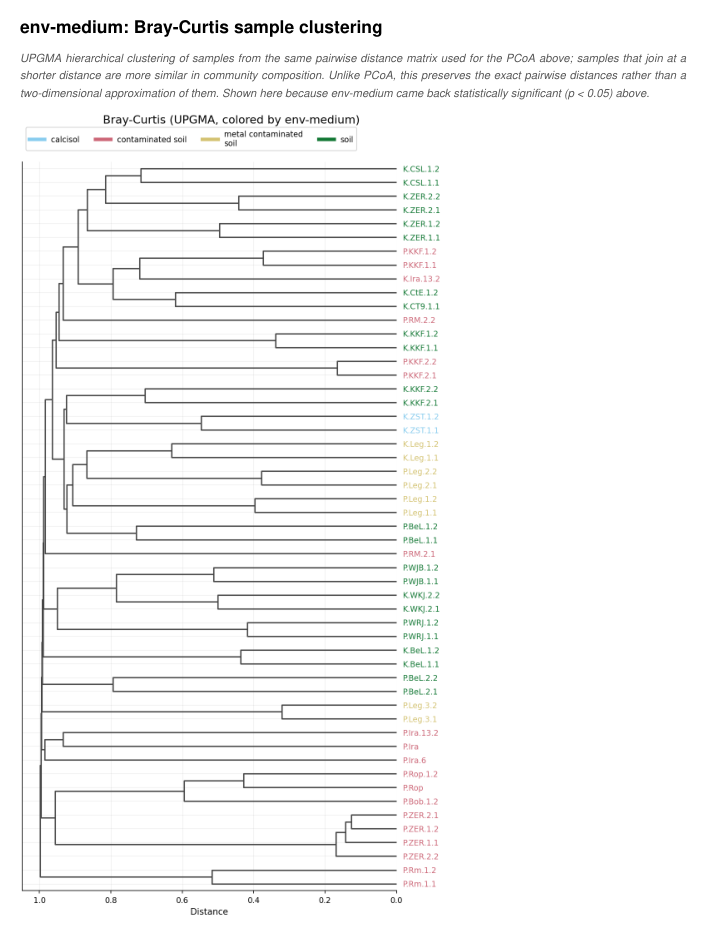
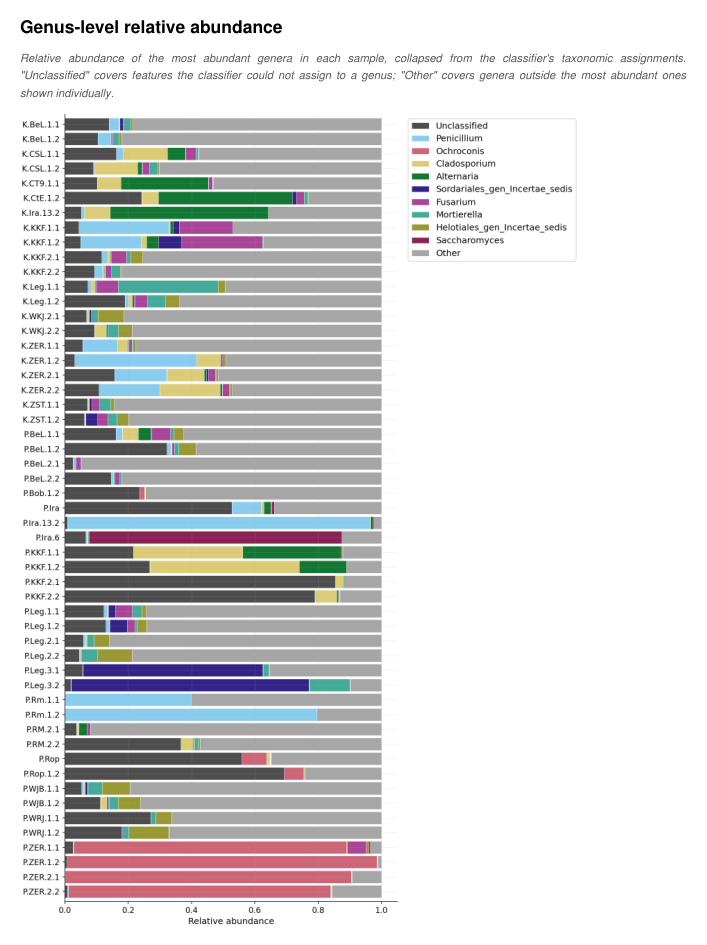

# Worked example: a public soil-fungi dataset, from SRA accession to PDF report

Everything needed to reproduce a real, production-scale `qiime2-its` run on public data -- and the
report it produced, so you can **see what you get before trying it**:

**[report.pdf](report.pdf)** (37 pages, 3.3 MB) -- the report exactly as the pipeline built it, with
one disclosed edit: before publishing, the user name, host name and the home-directory part of the
program path were blanked in `run_metadata.json` and the PDF was rebuilt from the same output
(`qiime2_its.report.build_report()`), so "Run by" reads "(not recorded)". Nothing else was touched.

| | |
|---|---|
| [](report.pdf) | [](report.pdf) |
| [](report.pdf) | [](report.pdf) |

| | |
|---|---|
| Data | NCBI BioProject [PRJNA767765](https://www.ncbi.nlm.nih.gov/bioproject/PRJNA767765) -- fungal ITS2 amplicons (Illumina MiSeq, paired-end) from soils in Poland and Iran |
| Samples | the 53 field samples (the BioProject's laboratory microcosm samples -- `BTEX_soil*`, `metal_soil*`, `control_soil*` -- are left out) |
| Size | 106 fastq files, 3.3 GB |
| Classifier | UNITE 2025-02-19, fungi, 99% clusters, no singletons (naive Bayes) |
| Command | `qiime2-its -pe --extract-its2 --taxa Fungi`, everything else left at its default |

## Reproduce it

Inside an activated QIIME2 conda environment with `qiime2-its` installed (`pip install qiime2-its`,
see [Installation](https://github.com/duceppemo/QIIME2_ITS/wiki/Installation)) and a clone of this
repository for the scripts, from an empty working folder with ~15 GB free:

```bash
EX=/path/to/QIIME2_ITS/examples/PRJNA767765

python3 $EX/01_fetch_metadata.py .   # optional: rebuilds metadata.tsv + download_manifest.tsv
bash $EX/02_download_reads.sh        # 3.3 GB from ENA into ./raw_reads, MD5-verified, resumable
bash $EX/03_train_classifier.sh      # UNITE classifier into ./classifier (slow; skip if you have one)
THREADS=40 PARALLEL=10 bash $EX/04_run_pipeline.sh   # -> ./output/report.pdf
```

| Script | What it does |
|---|---|
| [`01_fetch_metadata.py`](01_fetch_metadata.py) | Builds the QIIME2 metadata file and the download manifest from two public APIs (ENA file report, NCBI BioSample) -- standard library only. Its output is committed here as [`metadata.tsv`](metadata.tsv) and [`download_manifest.tsv`](download_manifest.tsv), so this step is optional; it exists so nothing in the example is hand-made. |
| [`02_download_reads.sh`](02_download_reads.sh) | Downloads each run's two fastq files from ENA under the Casava-style names QIIME2 requires (`<sample>_S<n>_L001_R1_001.fastq.gz`), checking every file against ENA's MD5. |
| [`03_train_classifier.sh`](03_train_classifier.sh) | Fetches UNITE with QIIME2's `rescript` plugin and trains the naive-Bayes classifier. |
| [`04_run_pipeline.sh`](04_run_pipeline.sh) | The analysis itself: one `qiime2-its` command. |

The run behind `report.pdf` used `qiime2-its` 0.3.2 on QIIME2 2026.7, with 40 threads /
10 parallel samples on a 64-core workstation, and took 3 h 28 min. Its exact command,
parameters, tool versions and input files are on the report's own provenance pages.

`metadata.tsv` doubles as a realistic template for your own metadata file: a `#q2:types` row, several
categorical columns with different numbers of groups, a numeric column.

## What to look for in the report

- **Which metadata columns get figures.** Alpha and beta diversity pages are produced for the
  default grouping column plus every column whose group-significance test came back significant
  -- here that is more than one, each with its own boxplots, PCoA plots and sample dendrograms.
- **A column with many, long group names** (`env-local-scale`): wrapped legends, vertical tick
  labels, colors *and* marker shapes once the groups outnumber the colorblind-safe palette.
- **Real-world unevenness**: two countries with very different sample counts, replicate structure,
  and a read depth spread wide enough that the rarefaction page is informative.

## Data and citation

The sequencing data belongs to its authors; this folder only contains scripts and the metadata
derived from the public archive records. If you use it, cite the study:

> Okrasińska A. *et al.* (2022). Marginal lands and fungi -- linking the type of soil contamination
> with fungal community composition. *Environmental Microbiology*.
> <https://doi.org/10.1111/1462-2920.16007> (the publication registered on the
> [BioProject record](https://www.ncbi.nlm.nih.gov/bioproject/PRJNA767765))

UNITE is distributed under CC BY-SA 4.0 -- see <https://unite.ut.ee/cite.php> for how to cite the
release used.
